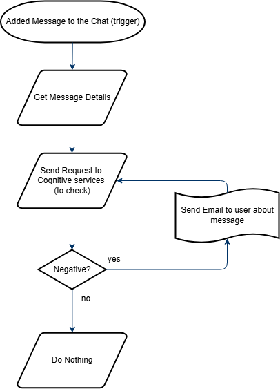

# CST8917 lab3

## Objective
Monitor Microsoft Teams messages, analyze sentiment using Azure Cognitive Services, and email admin if message is negative.

## Youtube link: https://youtu.be/8qbqZdaa6yo

## Flow Chart 


## Steps

### 1. **Create Azure Logic App**
1. Go to the [Azure Portal](https://portal.azure.com).
2. Click **Create a resource** → search for **Logic App (Consumption)**.
3. Fill in:
   - Resource Group: `your-resource-group-name`
   - Logic App name: `your-app-name`
   - Region: `Canada Central`
4. Click **Create**.
---

### 2. **Trigger Logic App via HTTP Request**
1. Before the logic app setup, make sure to click on **"When a new message is added to the chat or channel"** in teams, this allows you to grab the latest message.
2. In Logic App Designer, select **"When an HTTP request is received"**.
3. Add the following JSON:
   ```json
   {
     "type": "object",
     "properties": {
       "message": {
         "type": "string"
       }
     }
   }

### 3. Get Message Details
1. Added **"Get Message Details"** then set this up by being able to pull the latest message details, including the messageId
 
### 4. Send Message to Cognitive Services
1. Create the **cognitive services** via the Azure AI service.
2. Add **HTTP**
3. Make it "POST", with the URL: https://your-region.api.cognitive.microsoft.com/text/analytics/v3.2/sentiment
4. Add your api key
5. In the body include:
   ```json
   {
      "documents": [
      {
        "language": "en",
        "id": "1",
        "text": "@{triggerBody()?['body']['content']}"
      }
      ]
    }

### 5. In thn Condition block:
1. Add 'body('HTTP')['documents'][0]['sentiment']' to the expression, so that it is 'is equal to' and that is equal to 'negative'.

### 6. Send an email.
1. Add **Send an email(V2)**
2. If it set to 'negative', add a send email to alert the user. 
